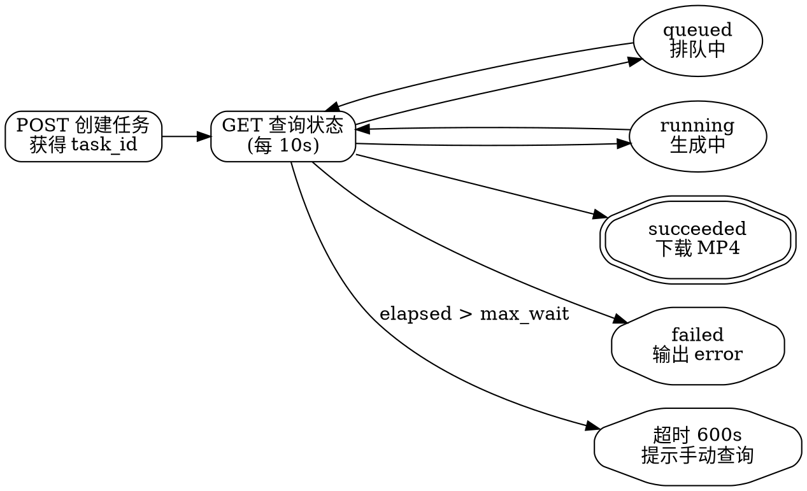

# Doubao Generate Video — 视频生成

调用火山方舟 Seedance 模型生成视频：文生视频、图生视频、多模态参考。

## Overview

封装 `client.content_generation.tasks.create()` / `.get()` 调用异步视频生成 API。**视频生成是异步三步流程**：创建任务 → 轮询状态 → 下载 MP4。默认模型 `doubao-seedance-2-0-260128`，时长 2-15 秒。前置条件：账户余额 ≥ 200 CNY 或已购买资源包。

## When to Use

- 用户要求生成/制作视频，提到 文生视频/图生视频/视频编辑/动图
- 需要从文字描述生成视频
- 需要从首帧图片（+ 可选尾帧）生成视频
- Seedance 2.0：需要多模态参考（图片+视频+音频混合输入）

## When NOT to Use

- 视频理解/分析 → 路由到 `doubao-general`
- 生成单张图片 → 路由到 `doubao-generate-image`
- 用户余额不足且无资源包 → 前置条件不满足，提示用户充值
- 时长 < 2 秒或 > 15 秒 → API 不支持

## 异步工作流（必读）

视频生成是异步的，**不能创建任务后直接等结果**。必须轮询：



## 前置条件

```bash
pip install volcengine-python-sdk python-dotenv
```

在项目根目录 `.env` 中**追加**（不要覆盖已有内容）：

```env
ARK_API_KEY=你的APIKey
DOUBAO_VIDEO_MODEL=doubao-seedance-2-0-260128  # 可选
```

> [获取 Key](https://console.volcengine.com/ark/region:ark+cn-beijing/apiKey) | 也可用 `export ARK_API_KEY=xxx`

```python
from dotenv import load_dotenv
load_dotenv()

import os, time, requests
from volcenginesdkarkruntime import Ark

client = Ark(
    api_key=os.getenv("ARK_API_KEY"),
    base_url="https://ark.cn-beijing.volces.com/api/v3",
)
model = os.getenv("DOUBAO_VIDEO_MODEL", "doubao-seedance-2-0-260128")
```

默认 `doubao-seedance-2-0-260128`（最强：多模态参考、音画同生、首尾帧、联网搜索）。

## 工作流程（异步三步）

1. **POST** 创建任务 → 获得 `task_id`
2. **GET** 轮询状态（每 10s）→ `queued` → `running` → `succeeded` / `failed`
3. **succeeded** → 从 `task.content.video_url` 下载 MP4；**failed** → 输出 `task.error`；**超时 600s** → 提示手动查询

## 使用场景

### 1. 文生视频

```python
# Step 1: 创建任务
resp = client.content_generation.tasks.create(
    model=model,
    content=[
        {"type": "text", "text": "一只橘猫在樱花树下追蝴蝶，阳光透过花瓣洒落，镜头缓慢推进，电影质感，4K"}
    ],
    ratio="16:9",
    duration=5,
    watermark=False,
)
task_id = resp.id
print(f"任务已创建: {task_id}")

# Step 2 & 3: 轮询 + 下载
max_wait = 600
elapsed = 0
while elapsed < max_wait:
    task = client.content_generation.tasks.get(task_id)
    print(f"状态: {task.status}")
    if task.status == "succeeded":
        r = requests.get(task.content.video_url)
        with open("output.mp4", "wb") as f:
            f.write(r.content)
        print("下载完成: output.mp4")
        break
    elif task.status == "failed":
        print(f"失败: {task.error}")
        break
    time.sleep(10)
    elapsed += 10
```

> 完整轮询模板脚本见 [scripts/poll_video.py](scripts/poll_video.py)。

### 2. 图生视频（首帧图）

```python
resp = client.content_generation.tasks.create(
    model=model,
    content=[
        {"type": "text", "text": "女孩睁开眼，温柔地看向镜头，头发被风吹动"},
        {"type": "image_url", "image_url": {"url": "https://example.com/first_frame.jpg"}}
    ],
    duration=5,
    generate_audio=True,
)
```

## 提示词技巧

格式：**主体 + 动作 + 场景 + 镜头 + 风格**

> 「一只金毛犬」在「阳光明媚的草原上」「奔跑跳跃」，「慢动作镜头从侧面跟拍」，「电影质感，暖色调」

中文 ≤ 500 汉字，英文 ≤ 1000 单词。5 秒适合单一动作特写，10-15 秒适合多段叙事。

首尾帧、多模态参考、有声视频、回调、完整参数表、分辨率矩阵等参见 [REFERENCE.md](REFERENCE.md)。

## Common Mistakes

| 错误 | 后果 | 正确做法 |
|------|------|----------|
| 创建任务后不轮询，直接假设成功 | 任务可能还在排队或已失败，永远拿不到结果 | 必须轮询 `task.status`，每 10s 检查一次 |
| 轮询只检查 `running`，忽略 `queued` | 任务在排队阶段被判定为"不是 running"，错误退出 | 同时接受 `queued` 和 `running` 两种中间状态 |
| 忘记设置 `max_wait` 上限 | 任务卡住时无限等待 | 设置合理的超时（如 600s），超时后提示手动查询 |
| 余额不足直接调用 | API 拒绝创建任务 | 确认余额 ≥ 200 CNY 或已购买资源包 |
| 参考图超过 9 张 / 视频超过 3 个 | API 拒绝请求 | Seedance 限制 ≤ 9 图、≤ 3 视频、≤ 3 音频 |
| 时长超出 2-15 秒范围 | API 参数错误 | `duration` 必须在 [2, 15] 之间 |
| 下载视频后不保存文件 | 下次使用需重新生成 | 下载后用 `open("output.mp4", "wb").write(r.content)` 持久化 |
| prompt > 500 汉字 | 部分内容被截断 | 中文 ≤ 500 汉字，英文 ≤ 1000 单词 |
